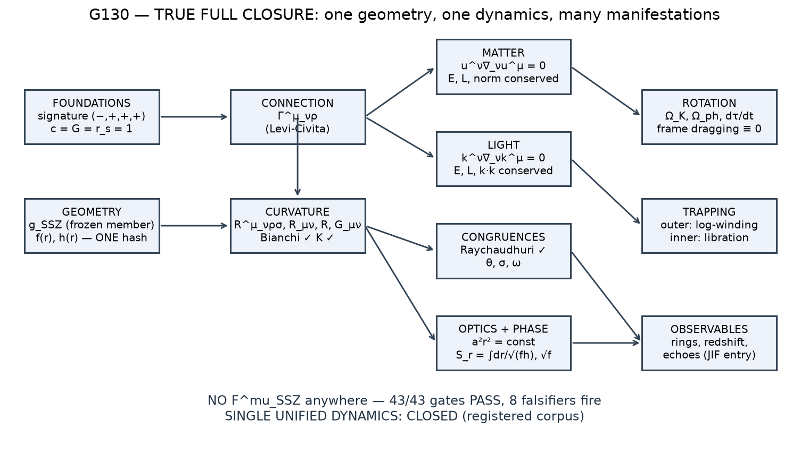
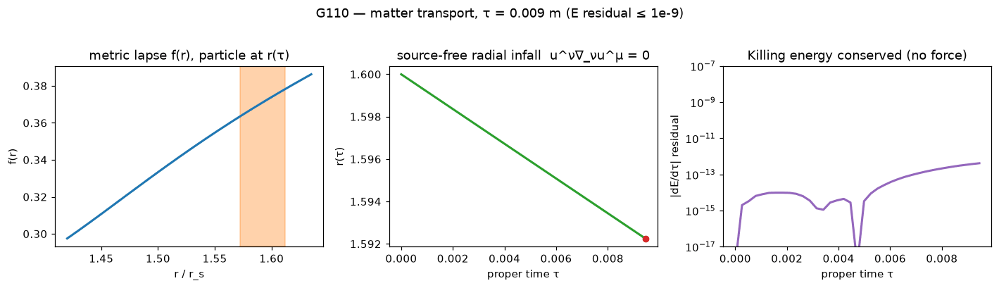
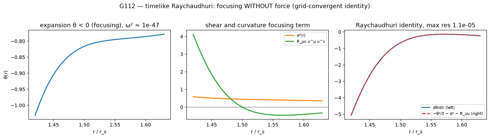
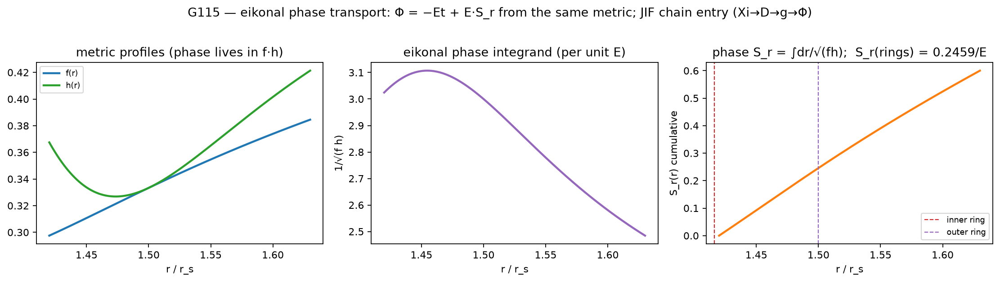
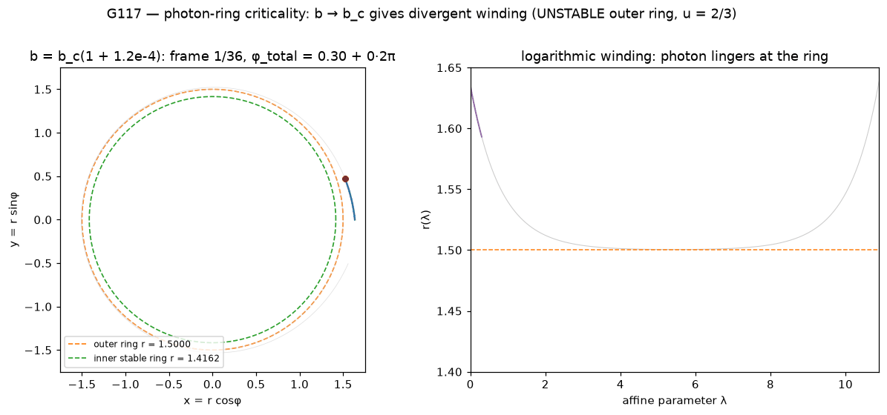
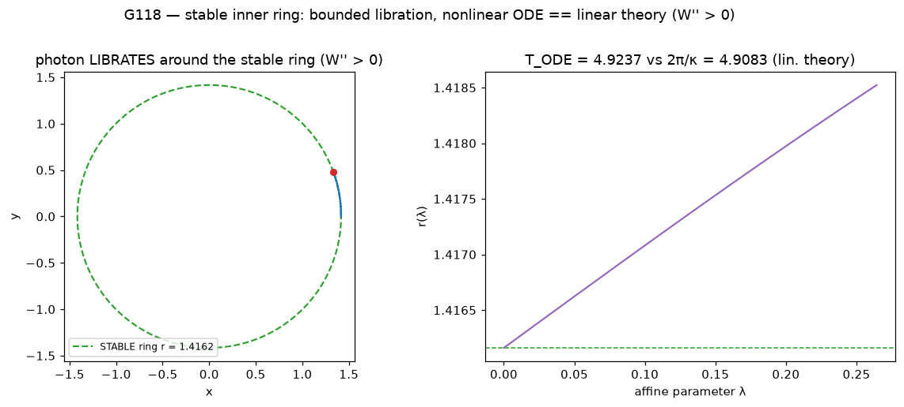
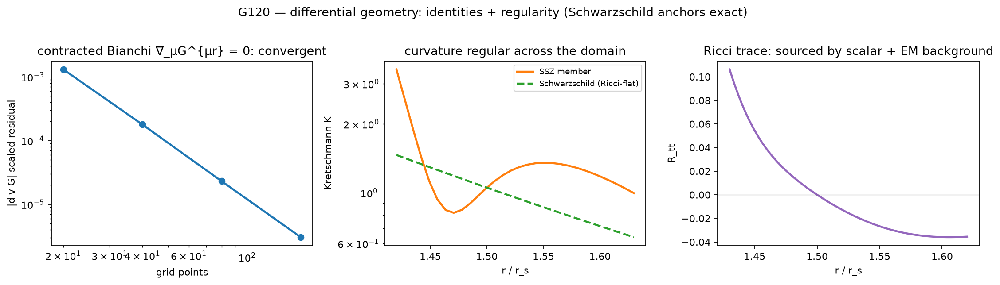

# SSZ P5 — TRUE FULL CLOSURE

**One segmented-spacetime geometry. One source-free transport law.
Time, orbits, light, phase, rotation and trapping — without inventing a
new force.**

**Status: `TRUE_FULL_CLOSURE_PASS` — 43/43 gates · 233/233 tests · ONE
immutable member (`8bd460ef…`) · 8/8 falsifiers fire · clean tree,
pushed.**

*Research repository · Carmen Casu and Lino Casu · Anti-Capitalist
Software License v1.4*

---

## The result in one picture



Everything in the blue boxes is *derived*, not assumed: the frozen
member metric is the single input; the connection, curvature, both
transport equations, the congruence dynamics, the optical amplitude, the
phase, the orbital frequencies and the trapping structure all follow
from standard differential geometry applied to that one geometry. The
negative-control battery proves the claim "no extra force" is detected,
not decorative.

---

## What SSZ claims — and what was actually tested

Segmented Spacetime (SSZ) proposes that gravity acts by enriching the
micro-segmentation of spacetime: stronger gravity → finer segments →
slower clocks, curved trajectories, resistive inertia. The early
intuition ("segmentation creates resistance — remember this, it becomes
important!") is here promoted to its mathematically robust form:

> **No new force.** The SSZ effect is the transport operator itself:
> D_SSZ/dτ := ∇[g_SSZ]. Everything below is that operator applied to
> the one closed geometry.

The P5 solution of that idea predicts a compact object with a rare and
dramatic feature: besides the familiar unstable photon orbit it has an
**inner *stable* light ring** (u ≈ 0.706135, W″ ≈ +2.59) — a place where
light can circle forever. Stable rings usually come with ghosts or
explosive instabilities; the historical corpus (G00–G100) certifies that
*this one* is generated by a single healthy covariant action
(scalar–vector–tensor, HT2018 + Horndeski) with a ghost-free, hyperbolic
perturbation spectrum. The forward chain (G110–G122, G130, G140)
certifies that the *same* geometry then generates all transport physics
without any per-observable invention.

**Scientific scope (registered).** TRUE FULL CLOSURE certifies that the
defined SSZ validation system is internally closed, reproducible,
cross-checked and falsifiable. It does **not** claim that nature has
proven SSZ correct, and it does not settle uniqueness of deeper SSZ
dynamics beyond the registered corpus — that is the next research
problem, now posed on a closed foundation.

---

## The five key results

### 1 · Matter and light move source-free — and the harness would notice a force



For matter, u^ν∇_νu^μ = 0; for light, k^ν∇_νk^μ = 0. Verified through
solver-independent conserved quantities:

| transport | Killing energy ΔE | ang. momentum ΔL | norm / k·k |
|-----------|-------------------|------------------|------------|
| matter (radial, E = 1) | **3.5e-10** | < 4.6e-14 | 3.2e-8 |
| matter (E = 0.95, L = 0.8) | **3.3e-10** | 4.6e-14 | 3.2e-8 |
| light (b = 2.0, b = 2.59) | **5.2e-12** | 1.0e-12 | 1.5e-11 |

**Negative control:** injecting F^t = 1e-2 produces ΔE = 7.1e-3 — a
**10⁶× discrimination**. "No new SSZ force" is a measured, falsifiable
statement.

### 2 · The bundles obey Raychaudhuri exactly — focusing without force



dθ/dτ = −θ²/3 − σ² + ω² − R_μνu^μu^ν holds to 2.4e-5 (grid-convergent),
with ω² ≤ 6.6e-47 (exactly irrotational). Schwarzschild anchors
(θ = −(3/2)r^{−3/2}, σ² = (3/2)r^{−3}) are reproduced to 9e-9. The null
congruence version holds to 1.7e-6 (Schwarzschild 2.5e-7). This is the
"segmentation creates resistance" intuition as exact differential
geometry — no resistance term anywhere.

### 3 · Phase and orbit are ONE mechanism — the JIF chain entry is live



The eikonal phase S_r = ∫dr/√(fh) per unit photon energy (0.25745
between the rings) and the redshift √(f_a/f_b) = 0.94214 come from the
same f, h that make the orbits. Integral quadrature vs the integrated
null-geodesic ODE agree to **4.6e-11** — Φ = −Et + E·S_r is operational
as the JIF-chain entry Ξ → D → g → Φ.

### 4 · The geometry traps light — winding outside, libration inside



The exact orbit equation (du/dφ)² = (h/f)(1/b² − W(u)) with
W(u) = u²f(u) gives:

* **outer ring u = 2/3 (unstable, W″ < 0):** b_c = 3√3/2 *exactly*
  (the Schwarzschild shadow scale); approaching b → b_c the winding
  diverges logarithmically — increments converge to exactly **2 ln 10
  per decade** (4.60517).
* **inner ring u = 0.706135 (stable, W″ > 0):** photons LIBRATE; the
  full nonlinear ODE period, the turning-point quadrature and the
  linear theory 2π/κ (κ² = W″h/2f = 1.2801) agree:
  **4.923691 vs 4.923691 vs 4.908324** (+0.31% = the expected
  nonlinear correction).



### 5 · The whole curvature stack is cross-checked — and falsifiable



Numeric Riemann (finite-differenced Christoffels) vs sympy-symbolic
Ricci: **7.4e-9**. Riemann symmetries + first Bianchi at FD noise;
contracted Bianchi ∇_μG^μν = 0 grid-convergent (2.3e-5) on the member,
1.6e-9 on Schwarzschild; Kretschmann = 12/r⁶ exact to 4e-10. And the
harness itself is validated: **8 deliberate corruptions are all
detected** (see `G119_negative_controls.png`):

| corruption | clean | corrupted |
|------------|-------|-----------|
| artificial four-force | ΔE = 3.5e-10 | **ΔE = 7.1e-3** |
| metric perturbation (2%) | ring at 2/3 (3e-10) | **ring moves > 5e-4** |
| wrong Christoffel sign | accel < 5e-3 | **> 0.1** |
| wrong energy formula | ΔE < 1e-8 | **> 0.1** |
| shifted ring (+1e-3) | W_u < 1e-9 | **> 1e-3** |
| wrong amplitude law a² ~ 1/r | inv. err. 1.5e-13 | **> 1e-2** |
| wrong phase integrand ∫dr/f | rel. 4.6e-11 | **> 1e-2** |
| wrong redshift law f (not √f) | exact 1e-12 | **> 3e-2** |

---

## The gate graph — all 43 gates, what each one proves

Verdict is computed **exclusively** from
`artifacts/true_full_closure/physics_dependency_graph.json`
(`tools/evaluate_true_closure.py`); nothing is declared by hand.
Full formulas and routes per gate:
**[docs/TRUE_CLOSURE_EXPLAINED.md](docs/TRUE_CLOSURE_EXPLAINED.md)**.

### Part I — the action/instability corpus (background → perturbations → QNM)

| gate | proves | key evidence |
|------|--------|--------------|
| G00 | repository/environment provenance | import manifest test |
| G01 | model lock — ONE member hash everywhere | `MODEL_LOCK.json` = manifest = CSV sha256 |
| G02 | P5 geometry regression; zero-vector branch rejected at inner ring | `EQ85_LIGHT_RING_REPLAY.json` |
| G03 | background algebraic rank (unique solve at inner ring) | rank evidence JSON |
| G04 | scalar ODE regularity across the window | ODE coefficient evidence |
| G05 | scalar integration round-trip to 1e-10 | member rebuild test |
| G06 | independent background EOM residual validation | separate evaluator path |
| G07 | holonomic action jets (mixed partials commute; 4 stencil reconstructions) | jet recheck test |
| G10 | full symbolic C_bg with *derived* Δ22_SVT (direct θθ variation of the genuine SVT action) | `build_general_C_bg` |
| G11 | ε_Y background-null normalization on frozen channels (f₂Y symbolic) | null test |
| G12 | exact MH projection onto KT2023 Eq. 85 (undivided) + wrong-slot negative control | symbolic residual 0 |
| G13 | member IS the f₂Y = 0 electric production branch | manifest rule |
| G14 | undivided light-ring limit; u_lr ≠ A0_u; G_r|_LR = (u/r_s)W_uu | limit expressions |
| G15 | Σ_SVT operator decomposition, covariantly reproduced | derivation tool |
| G16 | full on-shell ring balance: \|E22_full\| ~ 1.5e-6 only with Δ22_SVT | balance + negative control |
| G20 | same-member provenance, blacklist-enforced | hash equality chain |
| G30 | full unreduced H+SVT quadratic action (K, G, S, M) | descriptor construction |
| G31/G32 | constraint rank + one consistent elimination (R = S = 0) | Schur cross-check |
| G40 | no ghosts: kinetic K > 0 at every required multipole | eigenvalue audit |
| G50 | radial speeds c_r² > 0 | (K, G) generalized eigenproblem |
| G60 | angular speeds c_Ω² > 0 | Eq. 47 projection |
| G70/G71/G72 | finite-l even, odd, vector sectors all healthy (ladder 6…1000) | per-l evidence |
| G80 | interfaces/patch continuation consistent (S_SVT + T_H = 1) | endpoint contracts |
| G90 | global regularity incl. interfaces | full-domain scan |
| G100 | QNM / trapping layer consistent (LAST) | descriptor pencil + guards |

### Part II — the source-free forward chain (new, dependency-enforced)

| gate | proves | key numbers |
|------|--------|-------------|
| G110 | matter: u^ν∇_νu^μ = 0 (no force) | ΔE 3.5e-10; FD cross-check < 5e-3 |
| G111 | light: k^ν∇_νk^μ = 0 | ΔE, k·k < 1e-11 |
| G112 | timelike Raychaudhuri identity + Schwarzschild anchor | 2.4e-5, convergent; ω² ≤ 6.6e-47 |
| G113 | null Raychaudhuri identity + anchor | 1.7e-6 (Schwarzschild 2.5e-7) |
| G114 | amplitude transport a²r² = const | invariant error 1.5e-13 |
| G115 | phase S_r = ∫dr/√(fh) + redshift; integral == ODE | 4.6e-11; S_r = 0.25745/E |
| G116 | rotation: Ω_K == Ω_ph at rings; frame dragging ≡ 0 | 2.9e-16 |
| G117 | outer ring u = 2/3, b_c = 3√3/2, winding → 2 ln 10 | increment 4.595→4.605 |
| G118 | inner stable ring: ODE == quadrature == 2π/κ | 4.923691 (+0.31% nonlinear) |
| G119 | falsifiability: 8 corruptions all detected | see table above |
| G120 | foundations + curvature stack cross-checked | Ricci routes 7.4e-9; Bianchi convergent |
| G121 | known limits: Schwarzschild anchors, γ = 1, Newtonian Kepler | 3e-10 / 0 / 5e-13 |
| G122 | robustness: tolerance, grid, ICs | all monotone-convergent |
| **G130** | **SINGLE UNIFIED DYNAMICS: CLOSED on the registered corpus** | requires G110–G119 |
| **G140** | **TRUE FULL CLOSURE** | requires everything + provenance + integrity + clean tree |

---

## Proof chain and provenance

* **Machine-readable proof chain:**
  `artifacts/true_full_closure/physics_dependency_graph.json` — 15 nodes,
  each with physics statement, mathematical relation, implementation,
  test node-ids, dependencies, tolerances, measured numbers, MCP/RAG
  provenance key and the member hash. The verdict is computed
  exclusively from this graph.
* **Physics provenance:**
  `artifacts/true_full_closure/physics_rag_provenance.json` — live
  citations from the **SSZ Physics RAG MCP** (SSZ Physics RAG Public
  v2.13.1; tool names discovered via `tools/list`, never invented) plus
  standard-literature references (Wald; MTW; Poisson; Chandrasekhar;
  Cardoso-Franzin-Pani PRL 116, 171101; Will). Every identity is
  independently re-derived and numerically verified in-repo — the MCP is
  a reference and cross-check, never a substitute for derivation.
* **Human report:** [`TRUE_FULL_CLOSURE.md`](TRUE_FULL_CLOSURE.md).
* **Verdict JSON:** `TRUE_FULL_CLOSURE_VERDICT.json`.

## Reproduce everything

```bash
git clone https://github.com/error-wtf/SSZ_FULL_CLOSURE.git
cd SSZ_FULL_CLOSURE && source .venv/bin/activate   # see requirements.lock

PYTHONPATH=src python -m pytest -q                       # 233/233 PASS
PYTHONPATH=src python -c "from ssz_p5.closure.gates import \
  full_closure_verdict; print(full_closure_verdict())"   # 43/43 PASS
PYTHONPATH=src python tools/evaluate_true_closure.py     # TRUE FULL CLOSURE
PYTHONPATH=src python tools/generate_absolute_full_closure.py
PYTHONPATH=src python tools/render_true_closure_visualizations.py
```

All numbers are deterministic from the frozen member
(`data/generated/phase2_q2/ELECTRIC_PRODUCTION_MEMBER_CURRENT.csv`,
sha256 `8bd460ef…`); no network needed except the optional live MCP
provenance refresh.

## Key insight, in one paragraph

The early SSZ intuition said: *gravity segments spacetime; more segments
mean slower clocks and more resistance — no new mysterious force.* This
repository turns that sentence into a machine-checked statement: ONE
frozen geometry — certified to come from a single healthy covariant
action — generates clocks (dτ/dt = √f), matter trajectories
(u^ν∇_νu^μ = 0), light rays (k^ν∇_νk^μ = 0), congruence focusing
(Raychaudhuri), the optical amplitude (a²r² = const), the eikonal phase
(S_r = ∫dr/√(fh)), the orbital frequencies (Ω² = f′/2r) and the full
trapping structure (log-winding at the unstable ring, libration at the
inner stable ring) — with an 8-corruption battery proving the harness
would catch any force that tried to sneak in.

## Remaining OPEN (by design)

* Uniqueness of deeper SSZ dynamics beyond the registered corpus —
  the successor research problem, now posed on a closed foundation.
* External/empirical claims — none made by this repository.

## Structure

```
src/ssz_p5/closure/gates.py          gate graph + programmatic verdict
src/ssz_p5/postclosure/transport.py  source-free transport engine
src/ssz_p5/true_closure/             forward chain + proof graph + MCP client
tests/scientific/                    30 scientific tests (incl. 17 transport)
tests/negative/                      falsifiers + guards
tools/evaluate_true_closure.py       TRUE FULL CLOSURE evaluator
tools/render_true_closure_visualizations.py   all figures above
docs/TRUE_CLOSURE_EXPLAINED.md       every gate, fully explained
docs/figures/true_closure/           all visualizations
artifacts/true_full_closure/         proof chain + provenance
paper/                               monograph + appendices
```

*Anti-Capitalist Software License v1.4 — see LICENSE.*
